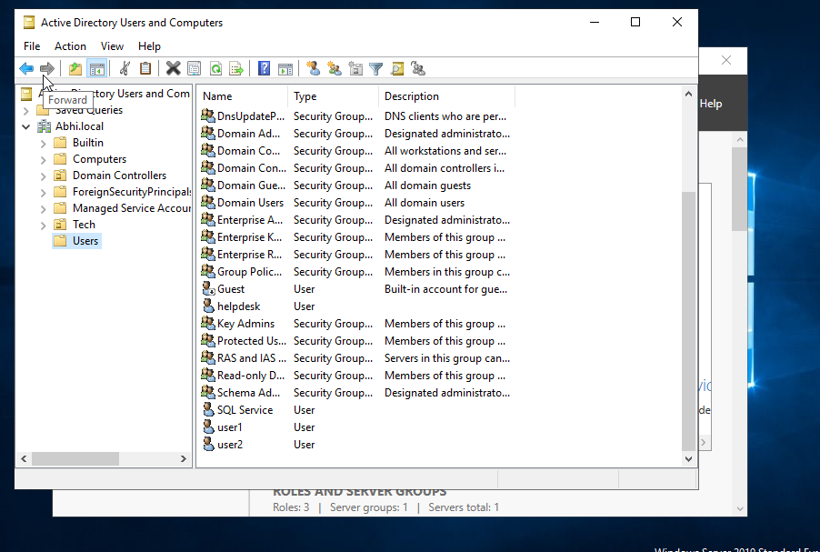
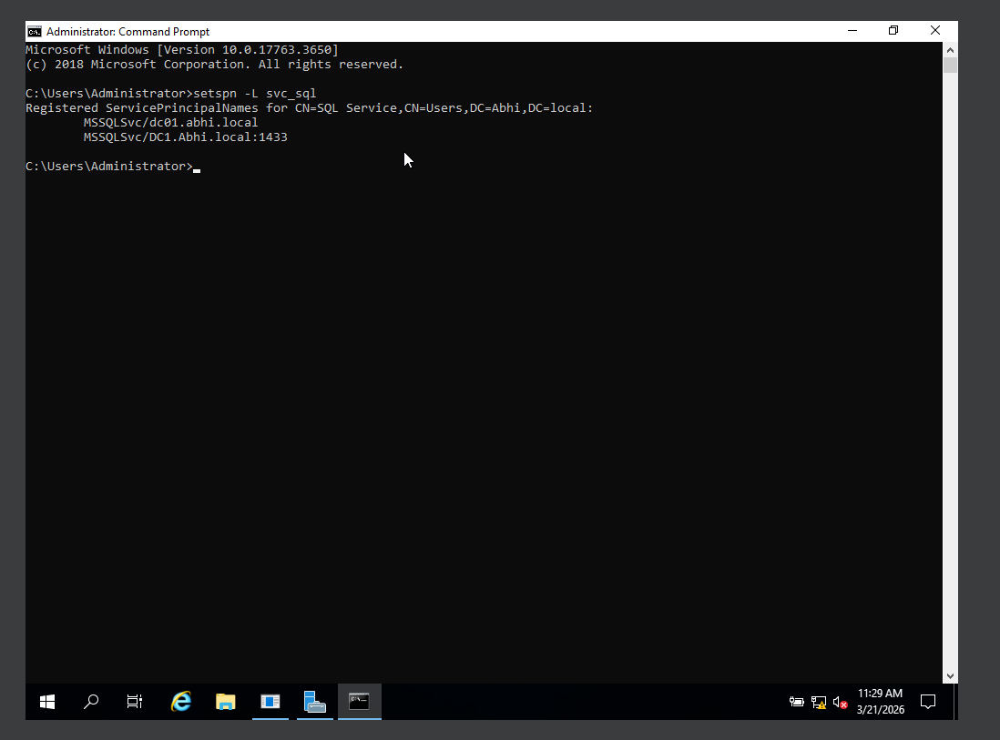

# VULNERABILITY CONFIGURATION

The Active Directory environment was intentionally configured with multiple security weaknesses to simulate real-world vulnerabilities commonly found in enterprise networks.

The following misconfigurations were introduced:

• Weak Password Policy:\
Users were assigned simple passwords such as "Password123" and "SQL123".

• No Account Lockout Policy:\
Multiple failed login attempts were allowed without account lockout, enabling password spraying attacks.

• Service Account Misconfiguration:\
A service account (svc\_sql) was configured with a Service Principal Name (SPN), making it vulnerable to Kerberoasting attacks.

• Excessive Privileges:\
The service account was granted elevated privileges, allowing privilege escalation within the domain.

• Lack of Monitoring:\
No logging or detection mechanisms were implemented, allowing attacks to go unnoticed.

<figure><figcaption></figcaption></figure>

<figure><figcaption></figcaption></figure>
